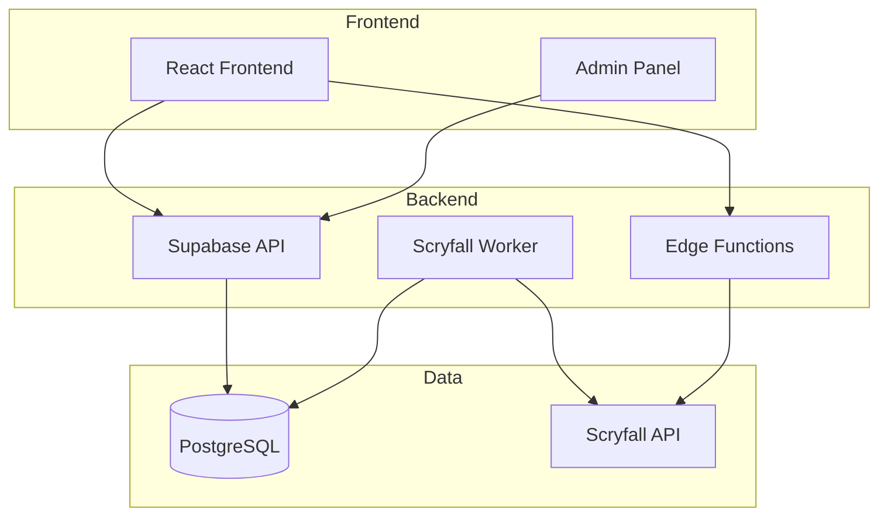
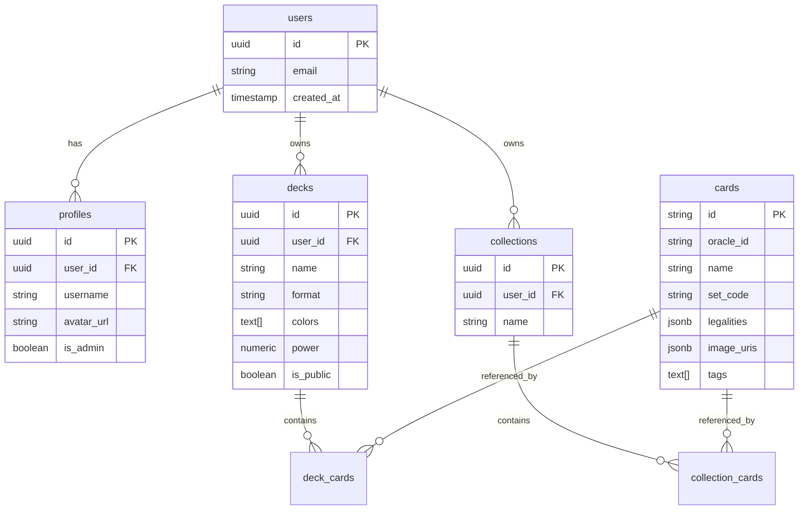

# MTG Deckbuilder - Architecture Documentation

## System Overview

## Technology Stack

### Frontend
- **Framework:** React 18 + TypeScript
- **Build Tool:** Vite
- **Styling:** Tailwind CSS + shadcn/ui
- **Routing:** React Router v6
- **State:** Zustand stores
- **Data Fetching:** React Query
- **Authentication:** Supabase Auth

### Backend
- **Database:** PostgreSQL (Supabase)
- **API:** Supabase Auto-generated REST
- **Functions:** Supabase Edge Functions (Deno)
- **Authentication:** Supabase Auth + RLS
- **File Storage:** Supabase Storage (future)

### External Services
- **Card Data:** Scryfall API
- **Hosting:** Lovable Platform
- **Database:** Supabase Cloud

## Data Architecture

### Core Entities

### Data Flow

1. **Card Sync:** Scryfall → Worker → Database
2. **Deck Building:** User Input → Edge Function → AI Logic → Database
3. **Collection:** User Import → Validation → Database
4. **Search:** User Query → Database FTS → Results

## Service Architecture

### Frontend Services
- **AuthService:** User authentication and session management
- **DeckService:** Deck CRUD operations
- **CardService:** Card search and filtering
- **CollectionService:** Collection management
- **BuilderService:** AI deck building interface

### Backend Services
- **ScryfallWorker:** Card data synchronization
- **AIBuilder:** Intelligent deck construction
- **PowerScorer:** Deck analysis and scoring
- **LandOptimizer:** Manabase optimization

### Edge Functions
- `ai-deck-builder`: AI-powered deck construction
- `scryfall-sync`: Card data synchronization
- `power-scorer`: Deck analysis (planned)
- `land-optimizer`: Manabase suggestions (planned)

## Security Model

### Authentication
- **Provider:** Supabase Auth
- **Methods:** Email/password, OAuth (future)
- **Session:** JWT tokens with refresh

### Authorization
- **Row Level Security (RLS):** Database-level access control
- **Role-Based:** Admin, User roles
- **Resource Ownership:** Users can only access their own data

### Data Protection
- **Encryption:** TLS for all communications
- **Validation:** Zod schemas for type safety
- **Sanitization:** Parameterized queries prevent injection

## Performance Considerations

### Frontend
- **Code Splitting:** Route-based lazy loading
- **Caching:** React Query for API responses
- **Memoization:** React.memo for expensive components
- **Bundle Optimization:** Tree shaking and compression

### Backend
- **Database Indexes:** On commonly queried fields
- **Connection Pooling:** Supabase managed
- **Rate Limiting:** Scryfall API respect
- **Caching:** Redis for expensive computations (future)

## Deployment Architecture

### Development
- **Frontend:** Vite dev server (localhost:8080)
- **Backend:** Supabase local development
- **Database:** Local PostgreSQL instance

### Production
- **Frontend:** Lovable Platform CDN
- **Backend:** Supabase Cloud
- **Database:** Supabase PostgreSQL
- **Functions:** Supabase Edge Runtime

## Monitoring & Observability

### Current
- **Logs:** Supabase function logs
- **Metrics:** Basic Supabase analytics
- **Errors:** Console logging

### Planned
- **Error Tracking:** Sentry integration
- **Analytics:** PostHog events
- **Performance:** Web Vitals monitoring
- **Uptime:** Health check endpoints

## Scalability Considerations

### Current Limits
- **Database:** Supabase free tier limits
- **Functions:** Edge function execution time
- **API:** Rate limiting on Scryfall calls

### Future Scaling
- **Caching Layer:** Redis for card data
- **CDN:** Image and asset optimization
- **Database Sharding:** User-based partitioning
- **Microservices:** Service separation as needed

## Development Workflow

### Local Development
1. Clone repository
2. Install dependencies
3. Configure environment
4. Start development servers
5. Database migrations (auto)

### CI/CD Pipeline
1. **Code Quality:** ESLint, TypeScript check
2. **Testing:** Unit and integration tests
3. **Build:** Production bundle
4. **Deploy:** Automatic via Lovable
5. **Migrate:** Database schema updates

## API Design Principles

### REST Conventions
- **Resources:** Nouns for endpoints
- **Methods:** Standard HTTP verbs
- **Status Codes:** Semantic HTTP responses
- **Pagination:** Cursor-based for large datasets

### Error Handling
- **Consistent Format:** Standard error response shape
- **Logging:** Comprehensive error tracking
- **User Messages:** Friendly error descriptions
- **Recovery:** Graceful degradation strategies