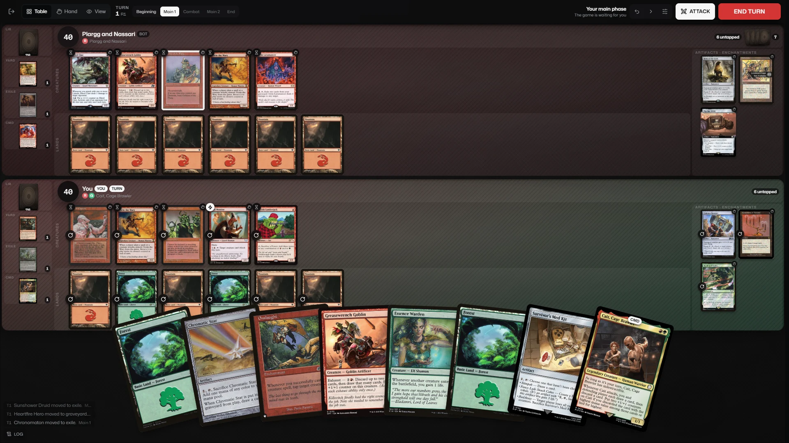
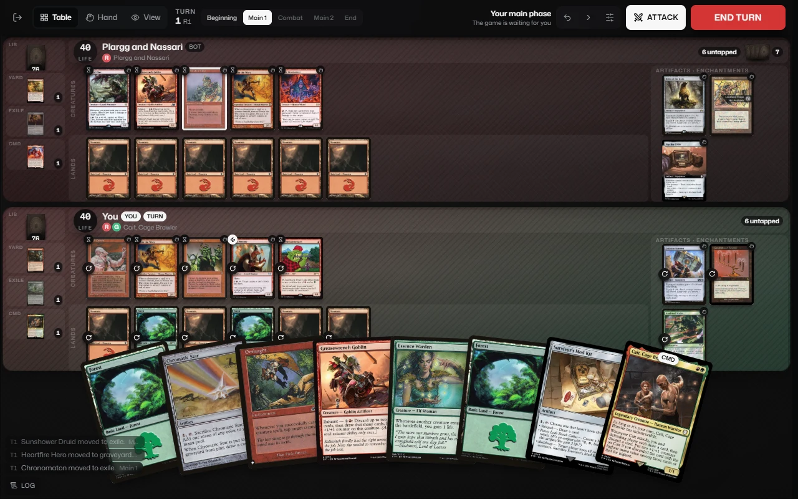
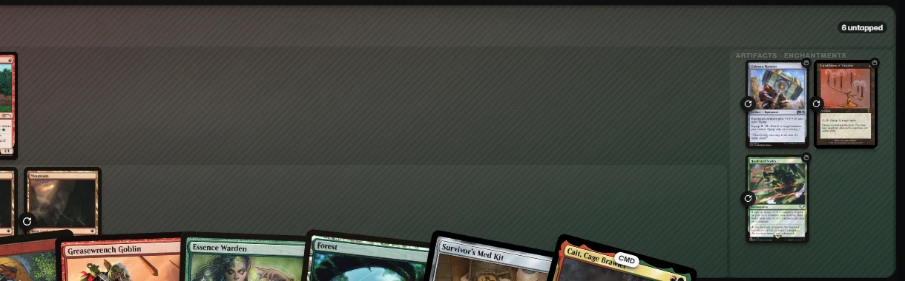
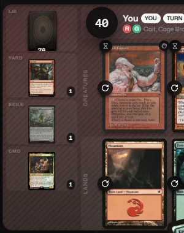
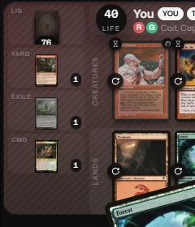
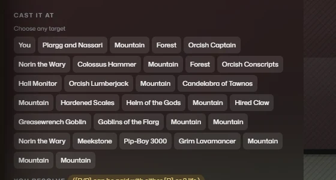
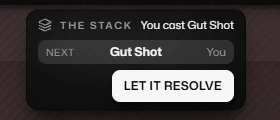
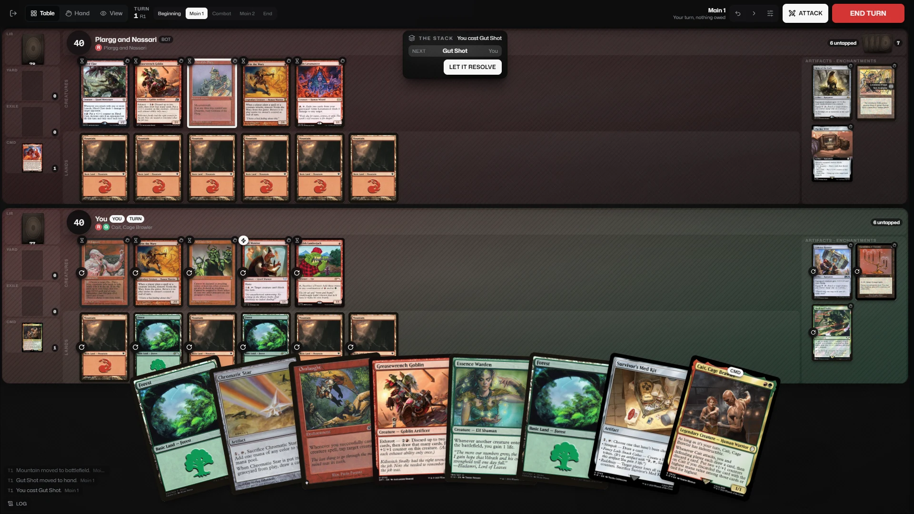

# Where the pixels go on the play screen

Written 23 Aug 2026. **No code was changed.** Every number below was read off a
live board through `getBoundingClientRect`, or sampled out of the screenshots
with `sharp`. Nothing is estimated and nothing is quoted from a source file
except the four constants named in "What LARGE means", which are cited with
their line numbers so they can be checked.

## How it was driven

`play-flow-harness.html` on a real Vite dev server, through Chrome by Puppeteer,
at **1280 x 800** and **1920 x 1080**. Versus bots, two seats, seed 7, opening
hand kept, bots then paused from the game menu so nothing moved during a
measurement.

The board was grown to a real mid-game position through `__dmDispatch`, which is
the same transport a click uses, so the reducer, `seatLayout` and the renderer
are all the shipped ones:

| Seat | Creatures | Lands | Artifacts and enchantments | Battlefield |
|---|---|---|---|---|
| You | 5 | 6 | 3 | 14 |
| Plargg and Nassari (bot) | 5 | 6 | 3 | 14 |

Both seats also had a card in the graveyard and a card in exile, so the zone
tiles were measured with something in them rather than as empty wells.

**One thing was done differently from the existing audit scripts, and it
matters.** `play-stress-audit.mjs` and its siblings abort the Supabase card
query. This run let it through. With the query blocked, all 118 cards come back
with `imageUrl` null and every card on the board draws as a named rectangle,
which is the first thing anyone would report as a bug. It is the harness, not
the product. See "Complaint 5" below.

Coverage is a **union**, rasterised on an 8px grid, not a sum of card areas. A
packed row overlaps, and summing would report more than 100% of a mat covered.

---

## The whole board, both widths

---

## 1. The mat rectangle, and what share of it holds a card

Identical on both seats, to the pixel.

| | 1920 x 1080 | 1280 x 800 |
|---|---|---|
| Mat rectangle | 1904 x 369 | 1264 x 263.5 |
| Its position, opponent then you | (4, 60) and (4, 437) | (4, 60) and (4, 331.5) |
| Mat area | 702,576 px² | 333,064 px² |
| Covered by its 14 cards | 223,347 px² (31.8%) | 116,643 px² (35.0%) |
| **Empty, one seat** | **479,229 px² (68.2%)** | **216,421 px² (65.0%)** |
| **Empty, both seats** | **958,458 px²** | **432,842 px²** |
| Viewport with no card on it | 1,624,064 px² (78.3%) | 788,992 px² (77.1%) |

Row by row, and this is where the empty space actually sits:

| Row (each seat) | Row box @1920 | Cards paint | Dead to the right |
|---|---|---|---|
| Creatures (5) | 1548 x 152 | 557 px, 36.0% | **956 px** |
| Lands (6) | 1548 x 153 | 670 px, 43.3% | **843 px** |
| Artifacts and enchantments (3) | 220 x 309 | 178 px, 80.9% | 21 px |

| Row (each seat) | Row box @1280 | Cards paint | Dead to the right |
|---|---|---|---|
| Creatures (5) | 930 x 107 | 380 px, 40.9% | **522 px** |
| Lands (6) | 930 x 107.5 | 457 px, 49.1% | **445 px** |
| Artifacts and enchantments (3) | 220 x 218.5 | 147 px, 66.8% | 55 px |

The support block is fine. It uses 81% of its box. The two long rows are the
problem, and they are not short of width. They are short of height, which is the
next section.

---

## 2. One creature's rendered width, against what LARGE means

Every creature on the table, both seats, rendered at exactly the same size:

| | 1920 x 1080 | 1280 x 800 |
|---|---|---|
| Creature card | **105 x 146.3** | **72 x 100.3** |
| Card in your hand | 257 wide | 191 wide |
| Hand card ÷ board creature | 2.45x | 2.65x |

### What LARGE means, in this repository's own numbers

* `BOARD_CARD_DEFAULT = 200` (`src/components/play/tableMetrics.ts:40`), and
  `SeatMat`'s `cardWidth` prop defaults to 200 with the comment *"a ceiling, and
  a deliberately generous one"*.
* `HAND_CARD_DEFAULT = 300` (`src/components/play/tableMetrics.ts:41`).
* `MIN_BOARD_CARD = 62` (`src/components/play/boardMetrics.ts:26`), described
  there as the size below which *"a card on the battlefield stops being
  identifiable at a glance"*.

Against those:

| | 1920 | 1280 |
|---|---|---|
| Board creature vs the 200 ceiling | 52.5% | **36%** |
| Board creature vs the 62 floor | 1.69x | **1.16x** |

At 1280 the board runs 10 px above the size the code itself calls unreadable.

### Why the card is that size, since the row is two thirds empty

The row box is 1548 wide and **152 tall**. A card is `width ÷ 0.7176` tall, and
`ROW_PADDING` is 6, so a 152px row can only hold a card 146.3 tall, which is
104.9 wide. That is the 105 that was measured. The card is capped by the row's
**height**, not its width.

For a card to reach the 200 ceiling the row would need `200 ÷ 0.7176 + 6 =
284.7 px`. It has 152. Meanwhile five creatures at the full 200 would occupy
1000 px of a 1548 px row and still leave 548 px spare.

So the two complaints are one complaint. The board is starved vertically while
956 px per row goes unused horizontally, and no change to the card size ladder
fixes that on its own.

---

## 3. The hand, and how much of the mat it covers

| | 1920 x 1080 | 1280 x 800 |
|---|---|---|
| Band rectangle | 1912 x 307.3 at (0, 764.7) | 1272 x 231.6 at (0, 560.4) |
| Painted fan | 1371.1 x 316.5 at (270.5, 739) | 1017.6 x 238.9 at (127.2, 537.3) |
| Cards in the fan | 8 at 257 px | 8 at 191 px |
| **Mat covered by the fan** | **91,864 px² (13.1% of your mat)** | **58,716 px² (17.6% of your mat)** |
| Permanents it lands on top of | 6 | 7 |

The opponent's mat is untouched at both widths, 0 px.

The fan is not clipped at either width: its bottom edge lands at y 1055.5 of
1080, and at y 776.2 of 800. What it does is sit on your own land row. At 1280
it covers the row almost end to end, which is visible in the 1280 screenshot
above.

---

## 4. The four zone tiles

Four per seat, eight on the table, identical on both seats.

| | 1920 x 1080 | 1280 x 800 |
|---|---|---|
| Tile | 116 x 72 (8,352 px²) | 94 x 49 (4,606 px²) |
| Card art inside it | **44 px wide** | **28 px wide** |
| Source image | 488 px wide | 488 px wide |
| Painted at this share of its own resolution | 9.0% | 5.7% |
| Against `MIN_BOARD_CARD` (62) | 0.71x | **0.45x** |

Legible? The frame colour reads and nothing else. At 44 px the art is a smudge
and the name is not resolvable. At 28 px the tile is under half the size this
repository already decided a card stops being identifiable at. Both numbers are
below that floor, so this is not a judgement call.

The library tile has no art by design: it draws a `LibraryStack` of card backs,
so it reports no image and that is correct.

---

## 5. The target prompt, and how far it sits from the cards it names

Driven for real: free cast on, `Gut Shot` moved to hand, opened. Its clause is
"deals 1 damage to any target", so the engine offered every legal target on the
table.

| | 1920 x 1080 | 1280 x 800 |
|---|---|---|
| Prompt | "Choose any target" | "Choose any target" |
| Chips offered | **30** | **30** |
| Chip row | 467 x 220 at (963, 241) | 597 x 156 at (513, 224.8) |
| Chip height | 28 px | 28 px |
| Chip width | 35.9 to 132.7 px | 35.9 to 132.7 px |
| All 30 chips together | 71,389 px² | 71,389 px² |
| One board card | 15,362 px² | 7,222 px² |
| Average chip vs one board card | 2,380 px², **6.5x smaller** | 2,380 px², 3.0x smaller |

**28 of the 30 chips name a card that is painted on screen at that moment.**
The other two are the two players.

Distance from a chip to the card it names, centre to centre:

| | 1920 | 1280 |
|---|---|---|
| Nearest | 212 px | 13 px |
| Median | **574 px** | 396 px |
| Farthest | **1151 px** | 884 px |

### The part that is not a matter of taste

The chip is `state.cards[id].name` and nothing else
(`src/components/play/TargetChoice.tsx`, `nameOf`). On this board that produces:

| Label | Chips carrying it |
|---|---|
| Mountain | **10** |
| Forest | 2 |
| Norin the Wary | 2 |

**14 of the 30 chips cannot be told apart from another chip.** Ten identical
"Mountain" buttons, and across those ten chips the Mountains they point at are
drawn between 212 px and 1201 px away, tapped and untapped, on two seats.
There is no reading of that list that tells you which one you are about to hit.
The owner's screenshot showed five chips and the problem was aesthetic. On a
real board it is a decision the interface cannot express.

One thing in this file's favour: `TargetChoice.tsx` is 113 lines and it is the
only drawing of this question. `AbilityPanel`, `SpellTargetPanel` and
`TriggerTargetBar` all import `TargetChoiceRow`. One fix covers all three.

---

## 6. Does anything render as a placeholder, and why

**No. 41 of 41 card views painted real art, at both widths, 0 placeholders.**
Every image came from `cards.scryfall.io` at 488 px natural width, complete.

The blank cards in the owner's screenshot have a cause, and it is upstream of
the play screen. When the card query does not return, every card in the game
carries `imageUrl: null`:

| | Card query blocked | Card query allowed |
|---|---|---|
| Cards in the game | 118 | 200 |
| Carrying an `imageUrl` | **0** | **200** |
| `` elements on the page | **0** | 10 and rising |
| Cards drawn as a named rectangle | **41 of 41** | 0 of 41 |

`GameCardView` is doing the right thing here. Its own comment says *"A card with
no art: still a card, not a placeholder"*, and that is what it draws. There is
nothing to fix in the renderer. What the screenshot shows is a card row that
arrived without an image, which is a data question and not a play-screen one.

### The stack, which is a different thing entirely

The empty box with a name in small text is **the stack strip**, and it is not a
card that failed to load. It is a text row, by construction.

| | Measured |
|---|---|
| Strip | 219.8 x 101 at (846.1, 64) |
| `` inside it | **0** |
| Card views inside it | **0** |
| The spell, as drawn | a 195.8 x 24.5 text row, 4,797 px² |
| The same card, in your hand, 700 px below | 257 px wide |

`StackStrip.tsx` renders a name, a controller and an index. It never asks for a
card. So the thing about to resolve, which is the single most important object
on the table while it is there, is 4,797 px² of text while a land you already
played is 15,362 px² of art.

---

## 7. The mat, which is not what it looked like

The mat is reaching the screen. Measured on the element, both widths, both
seats: `background-color` set, **8 background layers**, no bitmap.

Sampled out of the 1920 screenshot, 240 x 100 px of genuinely empty mat:

| Region | R | G | B |
|---|---|---|---|
| Opponent mat, mono red seat | 43 to 62, mean 52.7, sd 3.23 | 32 to 48, mean 40.6, sd 2.46 | 33 to 48, mean 41.0, sd 2.45 |
| Your mat, red and green seat | 57 to 81, mean 69.6, sd 4.24 | 59 to 78, mean 68.8, sd 3.55 | 54 to 72, mean 63.1, sd 3.36 |
| Board backdrop | 11 to 16, mean 13.4, sd 0.90 | same | same |

So: **seat identity is working.** A mono-red seat and a red-green seat sample as
different surfaces, and both sit clearly above the backdrop. **Texture is
working**, in the sense that it is there: the weave carries a standard deviation
of about 3 levels of 255, roughly 1.2%, with a 19 level peak to peak.

Three levels of 255 is why it reads as flat. And "no art" is literally true and
deliberate: `matStyles.ts` leaves `image` unset on all six built-in styles, and
the comment says why. Only a player's own upload puts a bitmap on a mat.

A large dark red field is exactly what a mono-red seat's mat is specified to be.
That is worth saying plainly rather than filing as a bug, because the fix people
would reach for first, more art, is the thing `Playmat.tsx` was rewritten to
remove and the Scryfall guidelines forbid.

---

## Which of the six is worth the most

**In pixels: the empty mat, and it is not close.**

| Complaint | Recoverable area @1920 | Recoverable area @1280 |
|---|---|---|
| **3. Empty mat** | **958,458 px²** | **432,842 px²** |
| 4. Hand over the board | 91,864 px² | 58,716 px² |
| 6. Zone tiles | 33,408 px² per seat | 18,424 px² per seat |
| 1. Target chips | 71,389 px² of chips | 71,389 px² of chips |
| 5. Stack | 4,797 px² | 4,797 px² |
| 2. Flat mat | nothing to recover, see section 7 | |

Complaint 3 is ten times complaint 4 and two hundred times complaint 5. It is
also the only one that pays out twice, because complaint 6's symptom, "the cards
are icons", is complaint 3's cause measured from the other end: the card is
105 px because the row is 152 px tall, not because a ladder picked a small step.
Give the rows the room and the card size follows, on all four seats, in one
place, because the geometry is already a pure function of the seat box in
`seatLayout.ts`.

**In clicks removed: none of them, and that is the point about complaint 1.**

Pointing at a card is one press. Pressing a chip is one press. The count is the
same, so this cannot be argued as a saving. What it is instead:

* **14 of 30 chips are indistinguishable**, so for those the interface cannot
  express the choice at all. The press is a guess.
* The target you are aiming at is **6.5x larger** as a card than as a chip at
  1920.
* The card is already drawn, at a median of 574 px from the chip that names it,
  so the interface is asking you to read a list while looking away from the
  answer.

**Recommendation.** Complaint 3 for the pixels, complaint 1 first for the cost.
`TargetChoice.tsx` is 113 lines and is the single drawing of this question
behind all three surfaces, so it is the largest correctness gain per line
touched on the screen. Complaint 3 is the largest gain overall and needs
`seatLayout.ts` opened with a plan for the vertical budget, not a nudge to a
constant.

Complaint 2 should be closed as measured rather than fixed. Complaint 5 is
small in area and cheap in effort: the stack has a card and does not draw it.

---

## Reproducing this

The measurement script is not checked in, on purpose: the four harnesses in
`scripts/` already cover layout shift, quads, clipping and the flow, and a fifth
would be one more thing to keep true. This run's raw output is in
`.shots/aaa-census/census.json`, `target-1920.json` and `target-1280.json`,
alongside the full-size PNGs the images above were cut from.
