# Play mode, sat down at as a player

Written 22 Aug 2026. Nothing in this document was changed in the app. It is a
record of playing the game and writing down every moment I did not know what to
do next, plus the two measurements the owner asked for by name.

## How this was done, and what could not be reached

The dev server ran on `http://localhost:8083`. Every screen below is the real
`/play` page over the real `src/lib/game` reducer, with real cards fetched from
the live card database, driven through Chrome by Puppeteer at 1280 x 800 and
1920 x 1080. Cards, decks, bot decisions and the rules are all genuine.

`/play` is behind a sign-in guard and signing in needs a password, which this
run does not use. The page was reached through the repository's existing
gitignored screenshot harness (`play-flow-harness.html`), which mounts the same
`<Play />` component without the guard. Nothing about the page differs. The
account-shaped parts of the product do.

* **Reached and played to a finish:** versus bots, goldfish and playtest, from
  pressing Play to a winner being announced.
* **Reached signed out only:** `/play/online` and `/play/t/:code`, which are on
  the signed-out route tree on purpose.
* **Not reached:** the signed-in lobby, an open table with two real people at
  it, and a game played across the connection. The last one is not a limit of
  this run. Step one of the flow says so itself, in the label position on the
  first door: **STILL BEING BUILT**.

One thing found before playing anything. Signed out, `/play` does not say "sign
in to play". It redirects to the marketing homepage with no message at all. A
person who presses Play a Game and lands on a sales page has no idea what
happened.

---

## The two the owner named, as numbers

### 1. The +1/+1 counter badge

Measured in a real game. Versus bots, two seats, a Greasewrench Goblin on my own
battlefield, three +1/+1 counters added through that card's own panel.

| viewport | the card on the mat | **+1/+1 badge** | badge text | tap chip, same card | manual duty dot, same card |
|---|---|---|---|---|---|
| 1280 x 800 | 72 x 100 | **22.4 x 16.0 px** | **9 px** | 20 x 20 | 13.6 x 13.6 |
| 1920 x 1080 | 105 x 146 | **22.4 x 16.0 px** | **9 px** | 25 x 25 | 17 x 17 |

The card grew by 46%. The tap chip grew by 25%. The duty dot grew by 25%. **The
counter badge did not move at all.** It is the only mark on a card that is not a
function of the card's width. `GameCardView.tsx` sets it as `text-[9px]` with
`leading-4`, a fixed size with no width term in it, while the tap chip and the
summoning sickness mark are sized proportionally a few lines further down and
carry comments explaining why they have to be.

Badge height as a share of card height: **16.0% at 1280, 11.0% at 1920**. The
glyph inside it is 9 px, so the digits stand about 6.5 px tall. That is smaller
than the printed power and toughness on the card art underneath it.

The same badge is drawn unchanged on the 28 x 39 command zone thumbnail, where
22.4 x 16 covers **80% of the card's width and 41% of its height**. So the one
fixed size is too small in the place that matters and too big in the place that
does not.

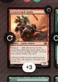

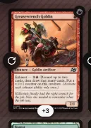

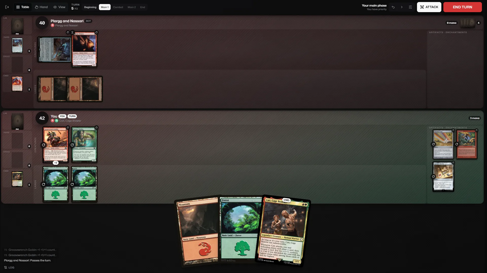

### 2. The artifacts and enchantments area, on a board that is mostly artifacts

Goldfish, one seat, so the whole screen is one mat and the block gets the best
case it will ever get. Thirteen noncreature nonland permanents were put onto the
battlefield by hand from the library, through the card preview's own
"To battlefield" control. The creatures row and the lands row were left empty on
purpose, so the picture is a board that is nothing but the block.

| viewport | seat mat | creatures row | lands row | **the block** | card in the block | columns | vertical step | how much of each card you can see |
|---|---|---|---|---|---|---|---|---|
| 1280 x 800 | 1264 x 535 | 885 x 234, **0 cards** | 885 x 235, **0 cards** | **220 x 473, 13 cards** | 86 x 120 | 2 | 52 px | **52 of 120 px, 43%** |
| 1920 x 1080 | 1904 x 746 | 1525 x 340, **0 cards** | 1525 x 340, **0 cards** | **220 x 684, 13 cards** | 115 x 160 | 1 | 38 px | **38 of 160 px, 24%** |

At 1920 the block is **220 px of the 1745 px the mat has across, 12.6%**, and it
is holding every permanent in play while **1525 x 680 px holds none**. Only the
last card in a column is fully visible. Every other card shows its title bar and
nothing else.

The block's width is capped in `seatLayout.ts`, at
`max(76, min(matWidth * 0.2, 220))`. The 220 is a hard ceiling, so the block is
the same 220 px on a 1264 px mat and on a 1904 px one.

**Making the window wider makes it worse.** At 1280 the card in the block is 86
px and two columns fit inside the block's 204 px of padded width. At 1920 the
card is 115 px, two of them no longer fit, and the block drops to a single
column. The same thirteen cards go from a two column grid to a thirteen deep
stack.

Four seats at 1920: each mat is 948 x 369 and each block is **190 x 309**.

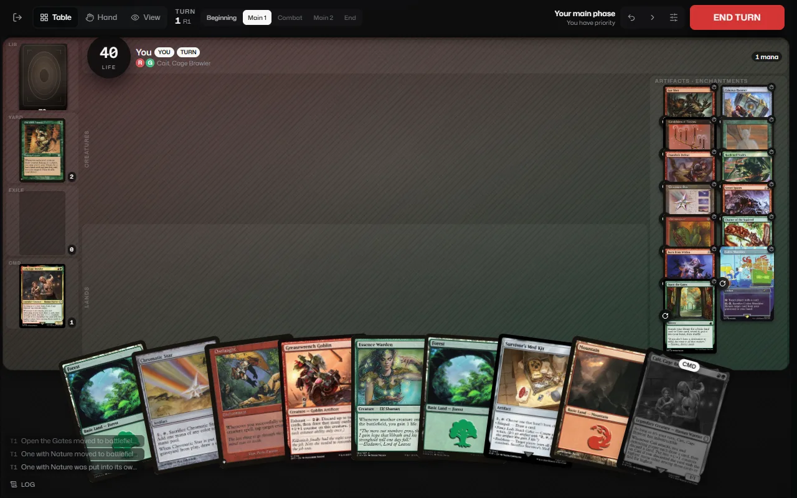

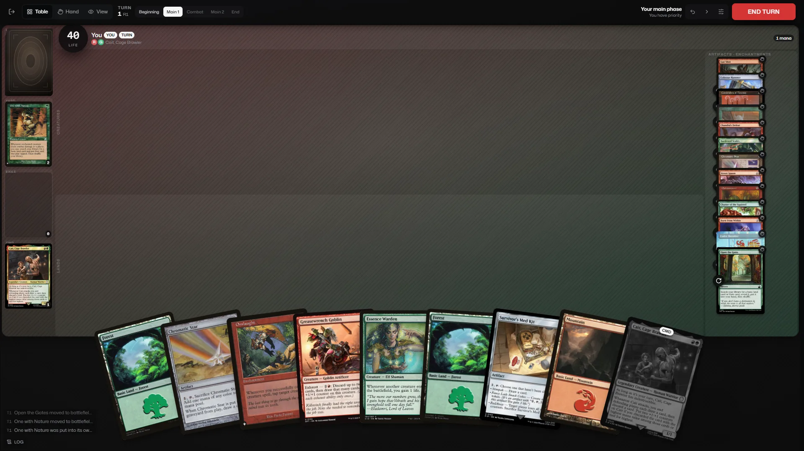

---

## Sitting down as four different people

### Someone starting a bot game

**Step one, choose a mode.** Four tall doors, 297 x 396 at 1280 and 457 x 609 at
1920, cut 3:4. **No image loads on any of them.** The page reports zero images at
both widths. Each door is a gradient with words on it. The first door, ONLINE,
is the one the owner asked to lead with, and it opens with STILL BEING BUILT in
the label position, above the mode's own name.

The word ENTER sits at the bottom of every door and looks like a button. It is
part of the door. Pressing the door works, so nothing breaks, but there are two
things that look pressable and one of them is decoration.

The forward control, "Choose a deck", sits **bottom right at y=612 of an 800 px
window**, and it is greyed out until a door is chosen.

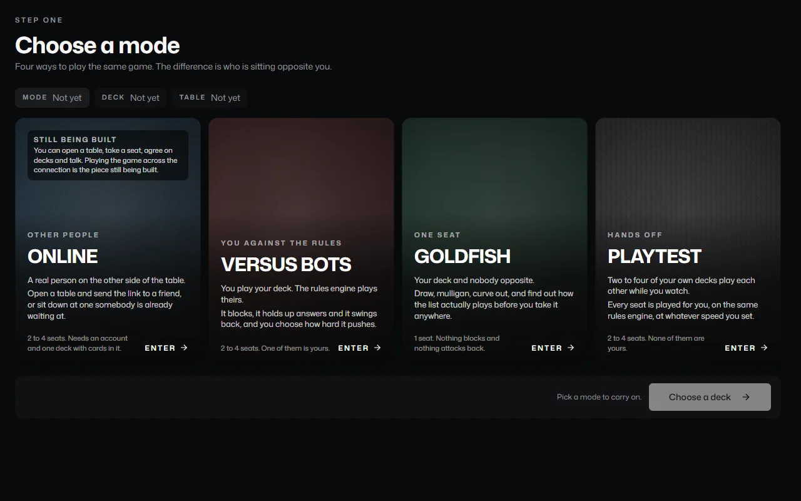

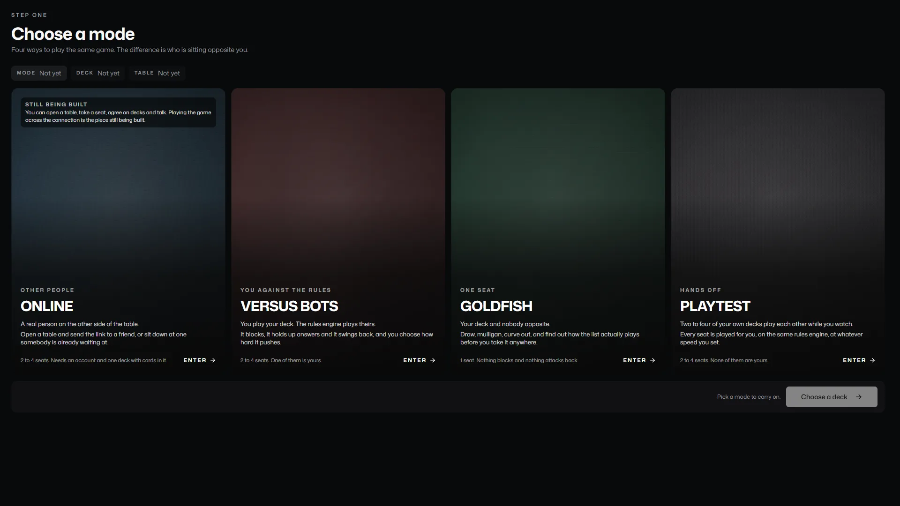

**Step two, choose your deck.** With no decks of your own the whole step is one
paragraph and two buttons. "Change mode" bottom left at y=410, "Choose
opponents" bottom right at y=408. This is the bottom bar the owner wants moved.

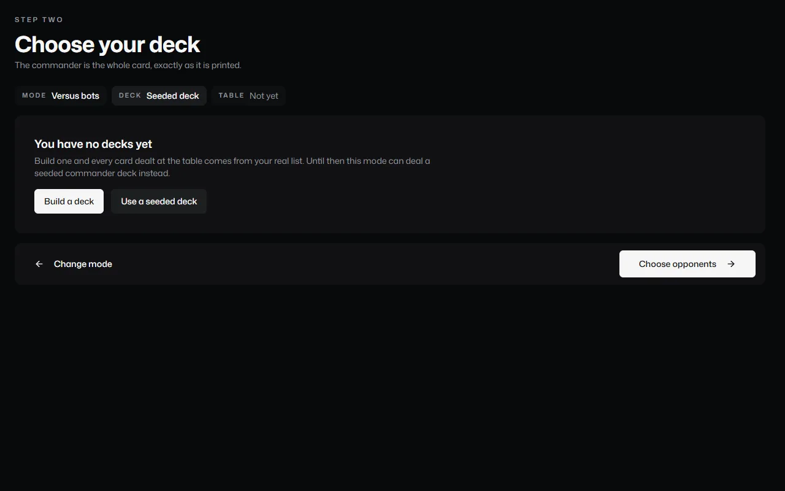

**Step three, fill the seats.** The start button is already top right, which is
the right place. Everything else around it is wrong. At 1920 the page is 1510 px
tall and every control below the seat tiles is packed into a **300 px wide
column on the left of a 1920 px screen**: bot temperament, seating, shuffle
seed, and the whole playmat picker with six texture tiles. The back control,
"Change deck", is at **y=1470**, four hundred pixels below the fold on a 1080
tall screen. So the page begins with its forward control at the top and ends
with its back control off the bottom.

The seat tiles show a grey rectangle with the words "Seeded commander deck" in
it rather than a commander card. Nothing on this step says it is about to be a
40 life Commander game until you are already at the table.

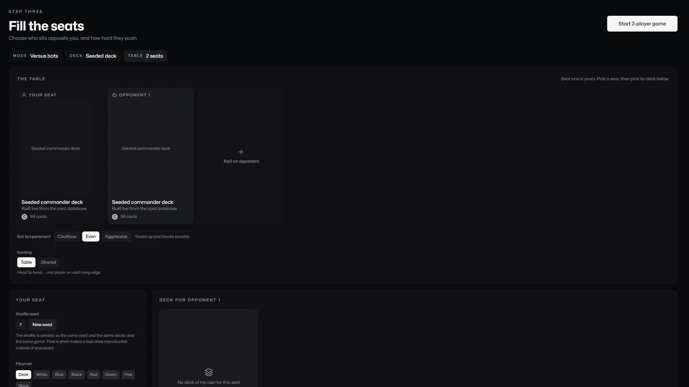

**The table, first sight.** Turn one, two seats, 1280 x 800.

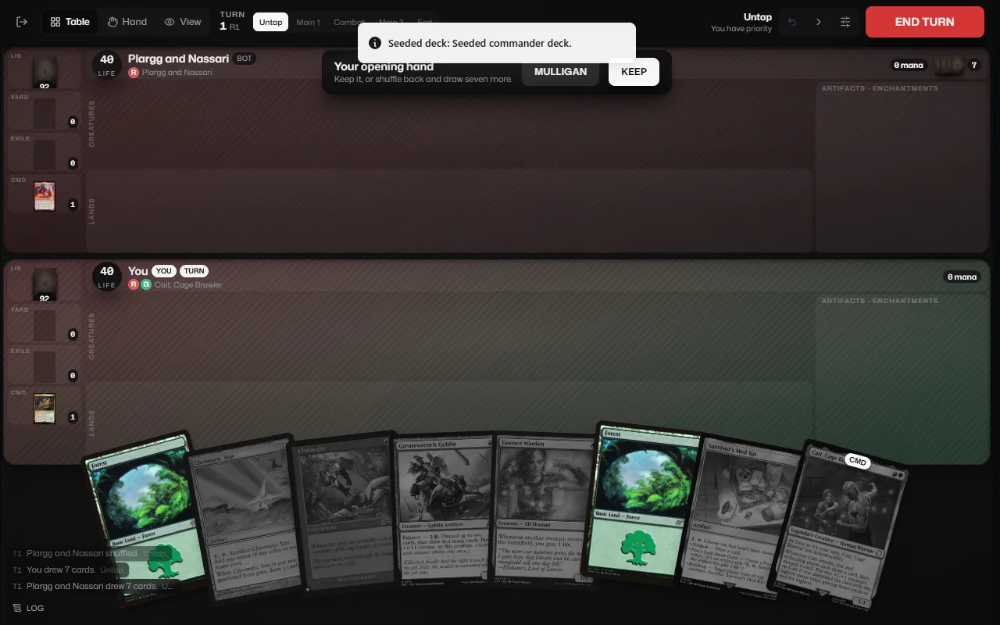

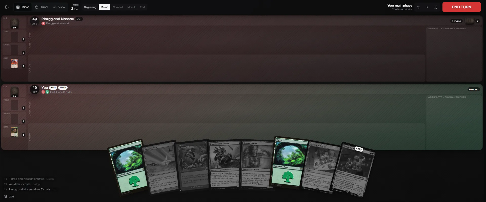

What I could not tell, in the order I wanted to know it:

* **How big is my board meant to be?** Two mats, each about 1030 px across, are
  empty apart from a huddle of cards about 100 px wide at the far left. At 1280
  a card on the mat is **72 x 100** while a card in my hand is **144 to 191 px
  wide**. The same card is two and a half times bigger in my hand than on the
  table, and the hand is the only thing on screen drawn at a readable size.
* **What is "0 mana"?** A chip on my own mat says "0 mana" while four untapped
  Forests sit below it. It is the floating mana pool, which is nearly always
  zero. Read at a glance it says I cannot cast anything.
* **Why is my hand grey?** Seven of nine cards are drawn in greyscale because I
  cannot cast them yet. On turn one that is the whole hand, so the first thing a
  new player sees is a hand of grey cards.
* **What is the LOG?** Bottom left, three lines of small grey text over the mat
  and a 56 x 28 button. It is the only history of what happened.

The mulligan bar and the "Seeded deck" toast both land in the top centre at the
same moment and overlap each other.

**Clicking a card works well.** Click anything and it takes the middle of the
mat at 352 x 490 with the real actions under it. That is the best thing on the
screen. Two problems with what is in the panel. It offers "Charge +1",
"Counter +1", "+1/+1 +1", "More counters" and "Keywords" on a **basic Forest**,
which is five controls that will never apply to it. And "PLAY LAND" is a full
width button while "To battlefield", "To graveyard", "To exile" and "To library"
are 23 px tall and greyed until you already know what they are for.

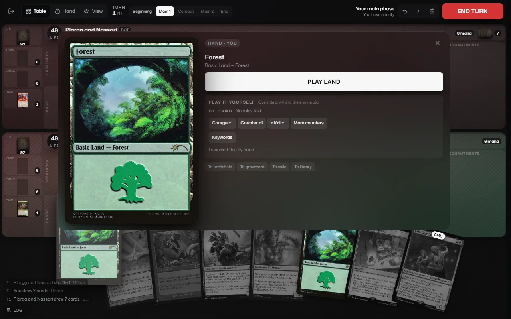

**Combat, and the worst moment in the product.** The bot attacks. The game stops
and waits for me to declare blockers. Here is what the screen says at that
moment:

* Top right, in the largest control on the page, where END TURN normally sits:
  **"PLARGG AND NASSARI'S TURN", greyed out and disabled.**
* Under the phase strip: **"Plargg and Nassari has priority".**
* Phase pill: "Declare Blockers".
* A bar floating over the opponent's mat: "Plargg and Nassari attacks you with 1
  creature. Press the shield on one of your creatures, then the attacker it
  blocks." with a 99 x 40 "NO BLOCKS" button.

Two of the three loudest signals say the opponent is acting. The game is waiting
for me. In an automated run this looked exactly like a hang: END TURN was pressed
again and again and nothing moved, because END TURN is not what the game wants.

The shields you are told to press are **24 x 24 px** on a 72 x 100 card, and the
tap toggles beside them are 20 x 20. Two round controls of almost the same size
sit on the same 72 px card and do different things.

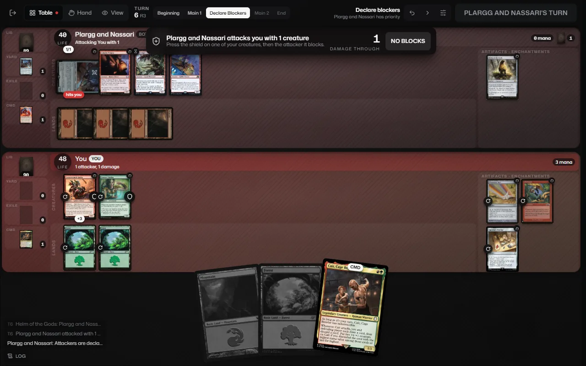

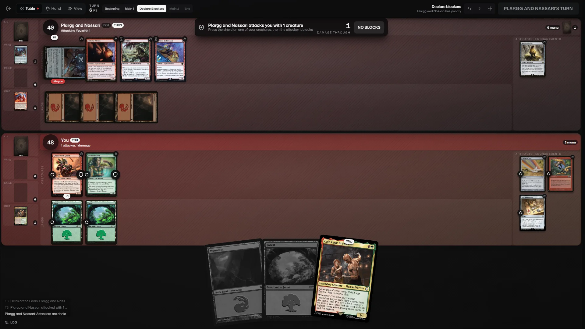

**Four seats.** At 1920 each mat is 948 x 369 and the hand, at 194 to 257 px per
card, is drawn on top of the bottom two mats.

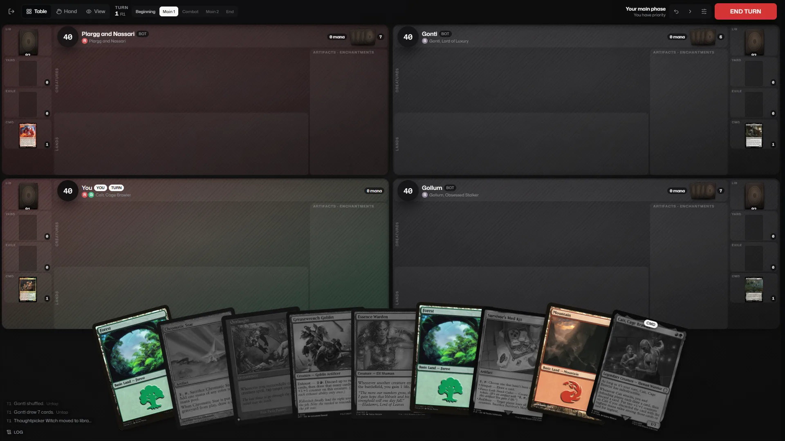

### Someone joining a table from a share link

Open `/play/t/ABCD12` without an account. The page says "Table ABCD12",
"Somebody invited you to a game", "Sign in to take your seat", and offers Sign
in and Make an account.

That is everything it says. Not who invited me, not what they are playing, not
how many seats are left, not whether the code is even real. The page already
knows how to answer all of it. `peekTable(code)` returns the host, the format
and how full the table is, and it is switched off for exactly the person who
needs it, by `enabled: Boolean(user)`. The file's own header says a signed-out
stranger should be told what they are looking at. They are told a six character
code.

So the sequence is: follow a friend's link, make an account, choose a password,
come back, and only then find out the table was packed away. Tables close after
30 minutes of nothing happening and the page does say so, but only after you
have signed up.

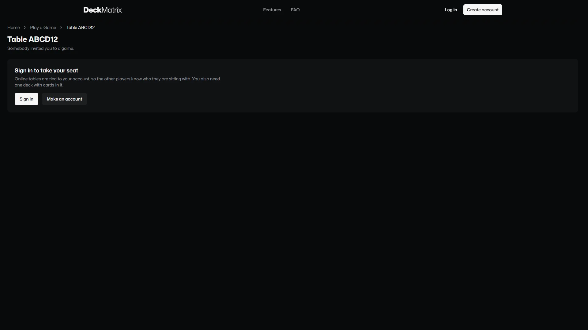

### Someone goldfishing

Goldfish reaches the table in three presses and works. The forward control is
called "Set up your seat" here, "Choose opponents" in bots and "Fill the seats"
in playtest, so one button has three names across three modes.

One seat means one mat filling the screen, which is the only place cards get
close to a good size. The block's label drops from "ARTIFACTS ·
ENCHANTMENTS" to "NONCREATURE" when the block is under 190 px wide. Nobody who
plays Magic calls that row "noncreature".

Looking in the library works and the copy is good: "91 cards, top of the library
first. Looking here is a search." The rail pushes the table over instead of
covering it, which is right, and the top card is marked TOP.

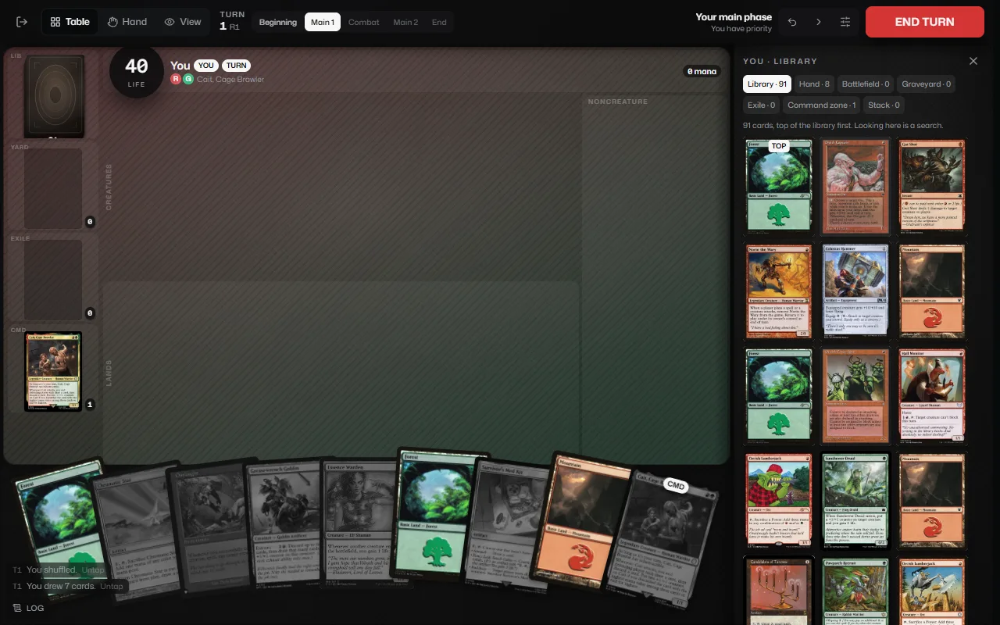

### Someone playtesting a deck they just built

Playtest reaches a finished game. Set the speed to Max and it plays 17 turns and
announces "Cait wins", with "Play it again" and "Change the decks". Its speed
controls already sit along the top, which is where the rest of the flow should
end up.

Two things contradict each other on the same screen at the same moment. The seat
badge says **WATCHING** and **BOT**, and across the middle of the board in
letters about 60 px tall it says **YOUR TURN**. No seat in a playtest is yours.
Step three of playtest also labels its settings block "YOUR SEAT" two lines
under a sentence saying none of the seats are.

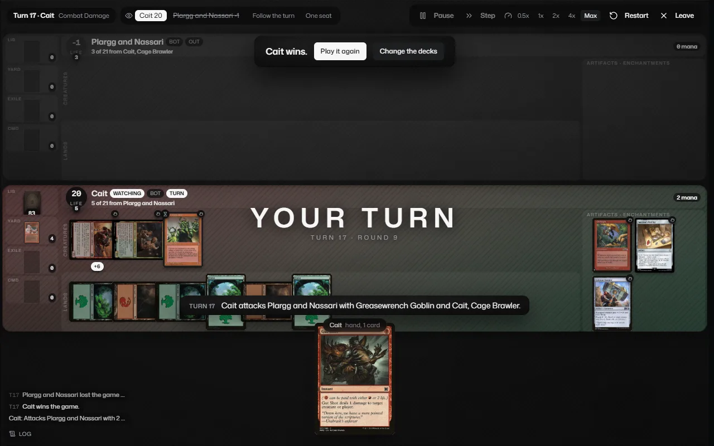

### The lobby, signed out

Two large empty panels. "Sign in to see who is playing", and "Discussion" with
"Nobody has posted yet". No tables, no people, no friends, and nothing live
("Sign in to see it update as it happens"). It reads like a settings page. There
is nothing here that looks like a room people are in.

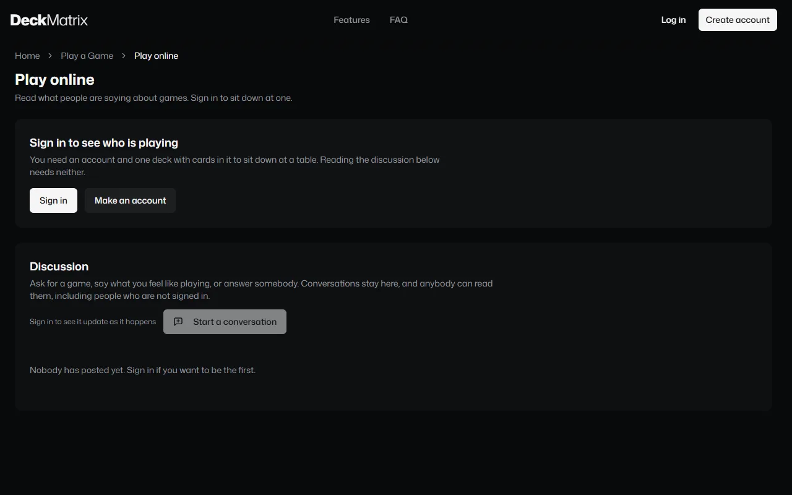

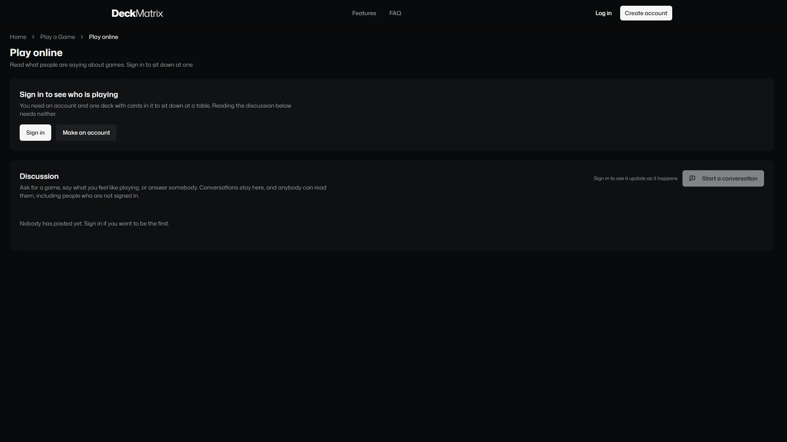

---

## Things I clicked that did nothing, or could not find

| what | what happened |
|---|---|
| The phase strip: Beginning, Main 1, Combat, Main 2, End | Nothing. It is a list of `span` elements styled as a pill row with the active one filled in. It looks exactly like a tab bar. A player will try to press Combat. |
| A life total | Nothing. `LifeBadge` is a plain div. There is no way to change a life total by hand anywhere in play mode, although `adjustLife` and `setLife` are written and tested in `src/lib/game/manual.ts`. |
| Looking for a way to make a token | Could not find one. `createToken` and `TOKEN_PRESETS` are in `manual.ts` and are referenced by nothing in `src/components`, `src/pages` or `src/hooks`. Commander cannot be played without tokens. |
| Looking for poison, energy or experience on a player | Could not find one. `PLAYER_COUNTER_PRESETS` is in `manual.ts` and has no caller. |
| The word ENTER on a mode door | Part of the door, not a control. |
| Anything explaining the screen | There is no help, no key and no legend. What the small round marks on a card mean lives only in a `title` you have to hover to find. |

## Things too small to read or too small to use

| thing | measured | where |
|---|---|---|
| +1/+1 counter badge text | 9 px, fixed at every card size | every permanent carrying counters |
| Card on the mat | 72 x 100 at 1280, 105 x 146 at 1920 | both main rows |
| Card in the artifacts block | 86 x 120 with 52 px showing at 1280, 115 x 160 with 38 px showing at 1920 | the block |
| Block label falls back to "NONCREATURE" | under 190 px of block width | one seat at 1280, and every four seat table |
| Block in a four seat game | 190 x 309 in total | four seats at 1920 |
| Block shield and tap toggle on a card | 24 x 24 and 20 x 20 | declare blockers |
| Attack sword on a card | 24 x 24 | declare attackers |
| Commander thumbnail in the rail | 28 x 39, carrying a 22.4 x 16 counter badge | every seat rail |
| The log | three lines of about 11 px grey text and a 56 x 28 button | bottom left of every table |
| "Your main phase / You have priority" | **disappears entirely below 1280 px wide** (`xl:flex`) | the HUD |

---

## The fix list, most confusion removed first

### 1. Make the top right button say what the game is waiting for

It currently says "PLARGG AND NASSARI'S TURN" and is disabled at the exact
moment the game is waiting for me to block, and the line under the phase strip
says the opponent has priority. This is the only item on the list that makes the
game look broken rather than awkward. When `decisionFor()` returns a decision
this seat owes, the biggest control on the page should be that decision:
DECLARE BLOCKERS, NO BLOCKS, ATTACK, and only otherwise END TURN or the
opponent's name. The same goes for the priority line, which should name who the
game is waiting on rather than who technically holds priority. One place,
`PlayHUD.tsx`, and it lands in all four modes at once.

### 2. Give the board the room the mat is already wasting, and stop shingling the block

At 1920 with thirteen artifacts down, 1525 x 680 px of the mat holds nothing
while a 220 px column hides 76% of every card in it. The two rows and the block
should divide the mat's width by what is actually on the board, recomputed only
when the count crosses a rung so nothing shuffles as cards arrive, which is the
rule `blockLayout.ts` already argues for and applies only inside the block. The
cheapest version that fixes most of it: when the block holds more than fits at
one card height, let it take width back from an empty row instead of stepping
down vertically. Second: never let the block fall to one column, so a wider
window is never worse than a narrower one.

### 3. Draw the cards on the table at the size the cards in hand are drawn

A card in hand is 191 px at 1280 while the same card on the mat is 72 px, and
the row it is on is more than 90% empty. Cards large and using the full width is
already the rule. The mat is not following it. This is the fix that makes the
board readable at all, and it takes away most of the need to open the centre
preview just to see what something is.

### 4. Size the counter badge from the card, like every other mark on it

22.4 x 16 at 9 px on a 72 px card, on a 105 px card and on a 28 px thumbnail.
The tap chip and the summoning sickness mark beside it already scale, and their
comments say why they have to. Make the badge do the same, with a floor so it
stays legible on a rail thumbnail and a ceiling so it does not swallow one.

### 5. Give a player somewhere to make a token, move a life total and add a poison counter

`createToken`, `TOKEN_PRESETS`, `adjustLife`, `setLife` and
`PLAYER_COUNTER_PRESETS` are all written, tested, and reachable from nothing.
Commander without tokens is not Commander, and a life total that only the engine
may change makes every card the engine cannot resolve unplayable. This is the
capability with no door pattern the project has already been through once,
sitting in the codebase right now.

### 6. Stop desaturating the card art

Every card you cannot cast, and every creature that cannot attack or block, is
drawn with `saturate-0 brightness-[0.52] contrast-[0.92]` over the Scryfall
image, in `GameCardView.tsx`, applied from `ViewerHand` and from `SeatMat`. That
is desaturating and colour shifting a card image. `Playmat.tsx` records this
project taking exactly that filter off the mat for exactly that reason. It is
also why a first hand looks broken: on turn one every card in it is grey. Say
"cannot cast yet" with something that is not the picture. A dimmed surround, a
mark, a lowered card, an unlit frame.

### 7. Make the phase strip either work or stop looking like tabs

Five pills with the current one highlighted and none of them pressable. Either
wire the ones that are legal jumps, and there is already an ATTACK button that
jumps from main to declare attackers, or draw it as a progress line rather than
a control. While that is open, bring the "You have priority" line back below
1280 px, where it currently vanishes.

### 8. Put the covers on the doors, and settle the shape first

`ModeWall` looks for `/covers/play/<id>.webp`, 3:4 portrait, and
`public/covers/play/` holds only a README. The four covers that exist are 16:9
landscape at 1376 x 768 in the Supabase `art` bucket under `.png` names. Those
two facts cannot both stand. Dropping a 16:9 image into a 3:4 door with
`object-cover` throws away more than half its width, and the covers were drawn
16:9 precisely so nothing has to be cropped. So the door becomes 16:9 and the
wall becomes a stack or a two by two grid, and the title sits in the cover's own
dark lower third rather than under a scrim laid over the whole picture. The
doors are the first thing anybody sees and they are four grey panels today.

### 9. Move the step controls to the top and make the flow read downward

Step one and step two carry their forward and back controls at the bottom. Step
three carries its forward control at the top and its back control 1470 px down,
below the fold. Put back and forward together at the top of every step, and give
step three's settings the width of the page instead of a 300 px column on a 1920
px screen. While that is open, the forward button is called "Choose a deck",
"Choose opponents", "Set up your seat", "Fill the seats" and "Watch the 2-player
game" across the flow. Fewer names.

### 10. Tell a stranger what they were invited to before asking them to sign up

`peekTable(code)` already returns the host, the format and how full the table
is, and it is switched off with `enabled: Boolean(user)`. Show it to the
signed-out visitor: who is hosting, what they are playing, how many seats are
left, and whether the code is still live. Then ask for the account.

### 11. Turn the lobby into a room, and put friends in it

Signed out it is two empty panels and a forum with no posts in it. The owner has
asked for a chat box, newest at the bottom, one column, type and press enter,
and for a friends list inside the play section. Neither exists. Extend
`lobby_posts` rather than adding a second table, keep the same safe renderer,
and decide out loud what a friend can see by default. This is the largest piece
of work on the list, and it sits below the ones above it only because those stop
a person who is already playing.

### 12. Fix the copy that contradicts itself

* "YOUR TURN" across the board in a playtest, where the seat badge says WATCHING
  and BOT.
* "YOUR SEAT" as a heading on playtest step three, two lines under "None of them
  are yours".
* "You's seat" as the accessible name of your own mat.
* "0 mana" on a mat with four untapped lands. Say what is available to spend, or
  do not put a mana chip there at all.
* "NONCREATURE" as a row label.
* Counter and keyword controls offered on a basic land.
* Signed out, `/play` redirects to the marketing homepage with no message.
